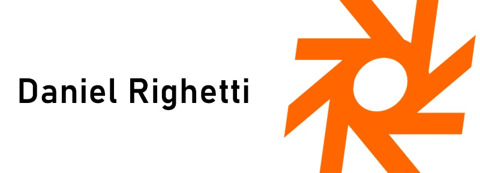

<table align="right">
  <tr>
    <td>
      <a href="readme-pt.md">🇧🇷 Português</a>
    </td>
  </tr>
  <tr>
    <td>
      <a href="README.md">🇺🇸 English</a>
    </td>
  </tr>
</table>

 

# Daniel Righetti Photography Portfolio | 

Welcome to the repository of my freelance project, Daniel Righetti Photography Portfolio. This project showcases the professional highlights of Daniel Righetti, an inspiring photographer. The portfolio is built using HTML, Sass, and JavaScript, incorporating modern design and animations to highlight his work.

**To view Daniel's portfolio online, click [here](https://danielrighetti.vercel.app/).**

## About Daniel Righetti

Daniel Righetti is a talented, passionate and photographer dedicated to capturing moments and emotions through his lens. With a creative vision and keen attention to detail, he has produced stunning photographs that speak volumes.

## Highlights

Here are some of the main features of this project:

- **Modern Design:** The portfolio is inspired by the most modern photographer websites worldwide, providing a sleek and engaging user experience.
- **HTML, Sass, and JavaScript:** The project is built using these technologies, ensuring a responsive and visually appealing design.
- **Animations:** The portfolio incorporates subtle yet captivating animations to enhance the visual appeal.

## Technologies Used

- [HTML](https://developer.mozilla.org/en-US/docs/Web/HTML)
- [Sass](https://sass-lang.com/)
- [JavaScript](https://developer.mozilla.org/en-US/docs/Web/JavaScript)

---